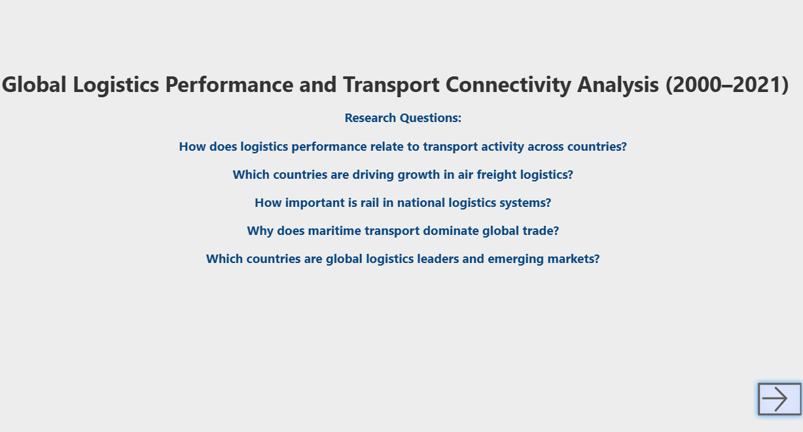
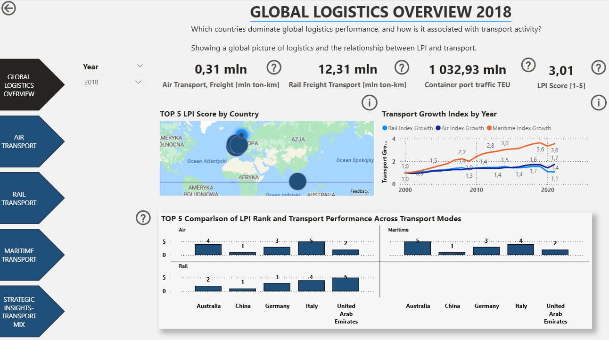
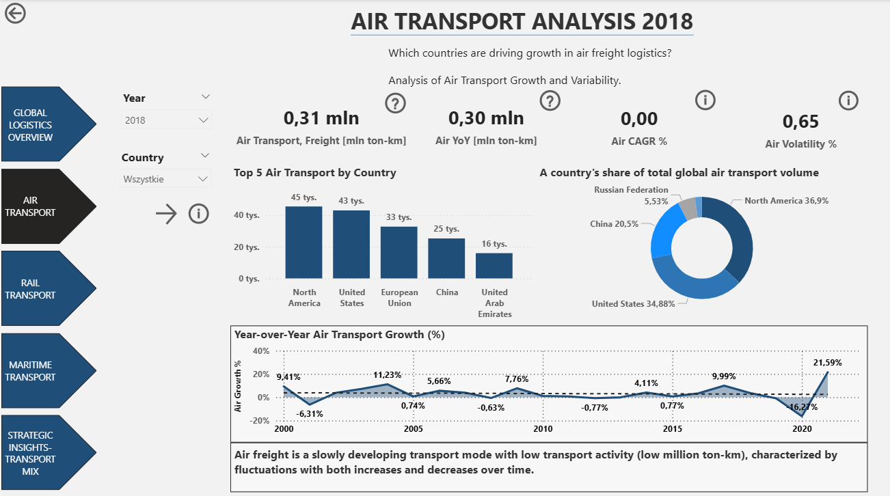
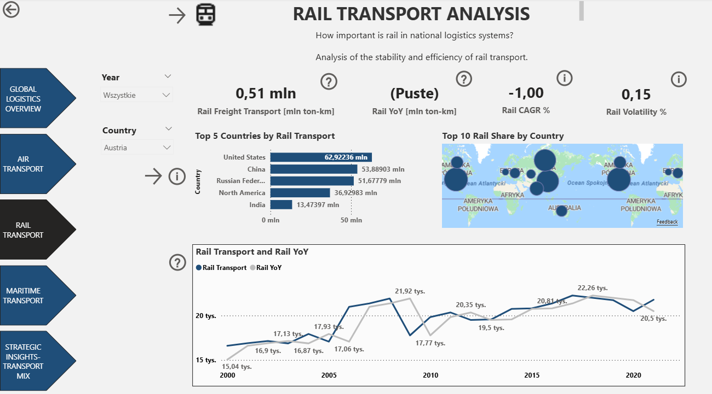
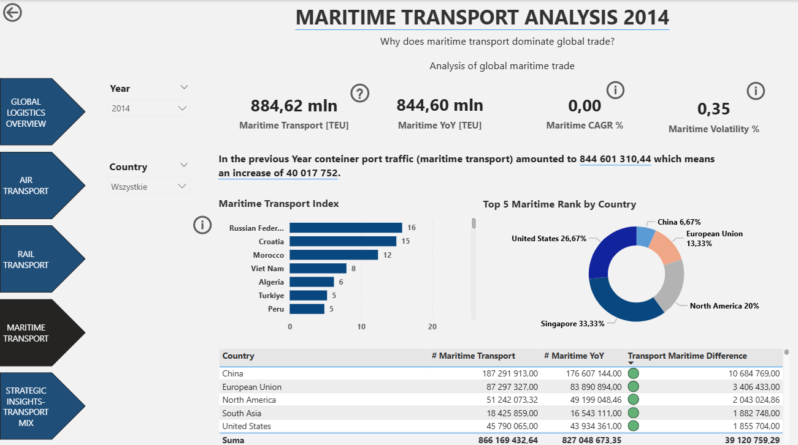
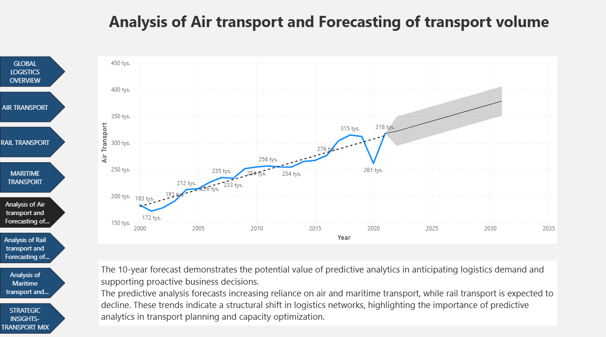
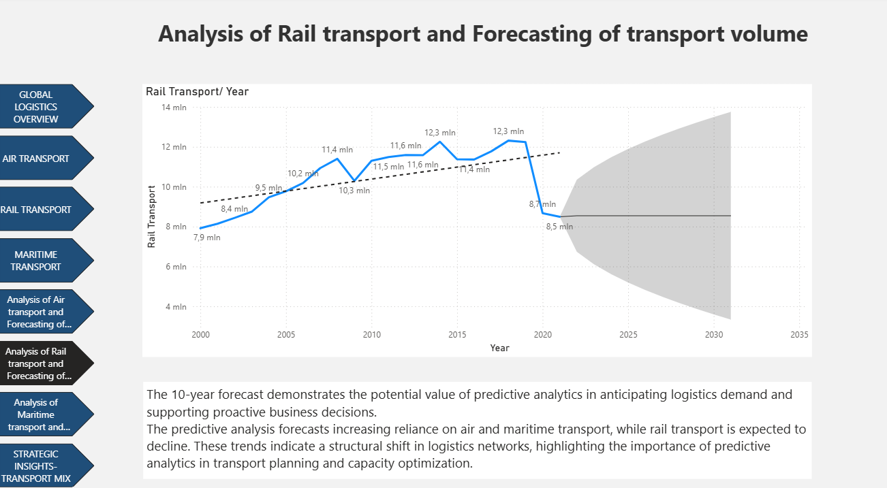
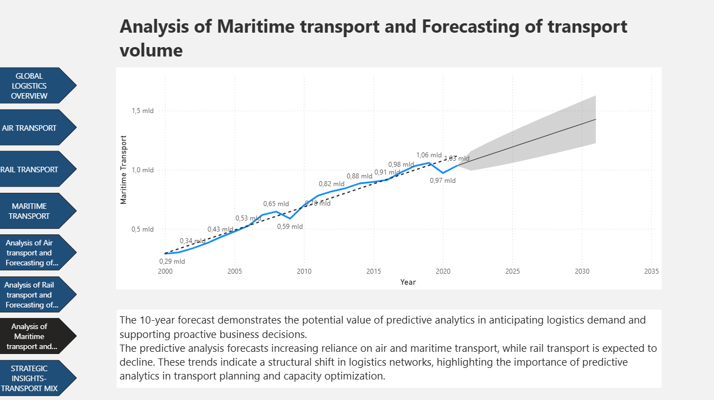
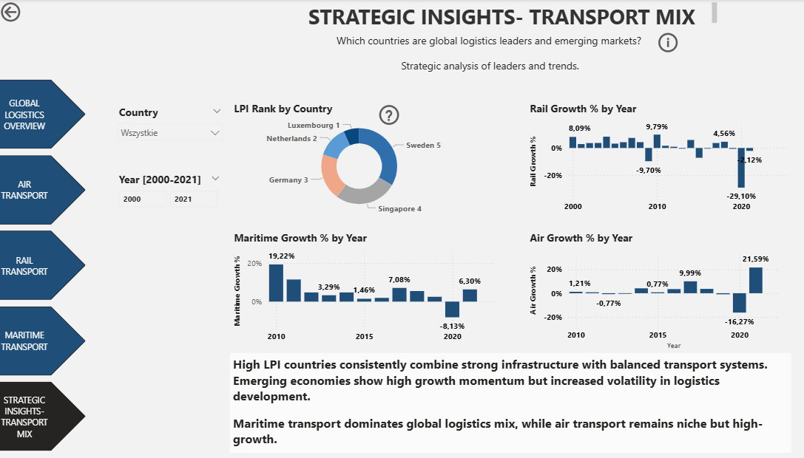
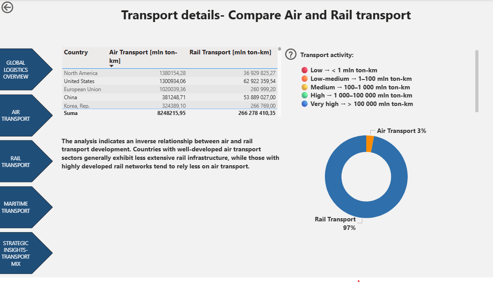

# Global Logistics Performance and Transport Connectivity Analysis (2000–2021) + Forecasting of transport volume

## Project Overview

This project analyzes global logistics performance and transport connectivity across countries from 2000 to 2021. The goal is to understand how logistics efficiency relates to transport activity and infrastructure development over time.

The study focuses on comparing countries’ logistics performance and identifying patterns in global trade connectivity, with particular attention to differences between high-income and developing economies.

## Objectives

- Analysis trends in global logistics performance over time  
- Comparision of transport connectivity across countries
- Comparison of transport efficiency across different transport modes (air, rail, and maritime transport)
- Identification of global logistics leaders
- Verification the relationship between logistics efficiency and transport activity
- The aim of the dashboard is to leverage historical logistics data to identify trends and provide predictive insights on transport volumes, enabling data-driven decision-making, proactive capacity planning, and optimization of supply chain operations.  
  

## Dataset

The analysis is based on publicly available global datasets (World Bank):
API_IS.AIR.GOOD.MT.K1 
API_IS.RRS.GOOD.MT.K6 
API_IS.SHP.GOOD.TU 
API_LP.LPI.OVRL.XQ 
Logistics Performance Index (LPI), including indicators such as:
- Air, Rail, Maritime transport
- YOY, CAGR, volatility

Time range: **2000–2021**

## Zrzuty ekranu

## Methodology

The project involves:

- Data cleaning and preprocessing
- Aggregation of country-level indicators
- Time-series analysis (2000–2021)
- Correlation analysis between logistics performance and transport activity
- Visualization of global trends

## Key Insights

- Countries with higher logistics performance tend to show stronger transport connectivity
- Transport infrastructure and customs efficiency are key drivers of performance differences
- Improvements over time are visible, but global disparities remain significant
- Forecast results show sustained growth in air and maritime transport volumes, alongside a projected decrease in rail transport. This reflects a potential long-term modal shift driven by evolving supply chain requirements, including speed, flexibility, and global connectivity

## Tools & Technologies

- Power BI 
- Power Query
- DAX
- Excel / CSV datasets

## Project Structure

- `Title/` 
- `Global_Logistic_Overview/` 
- `Air_Transport/`
- `Rail_Transport/`
- `Maritime_Transport/`
- `Analysis_of_Air_Transport_and_Forecasting_of_transport_volume/`
- `Analysis_of_Rail_Transport_and_Forecasting_of_transport_volume/`
- `Analysis_of_Maritime_Transport_and_Forecasting_of_transport_volume/`
- `Strategic_Insights1_Transport_Details/`
- `Details/`   
- `README.md`   

## Author

Milena R.

## License

This project is for educational and portfolio purposes.
